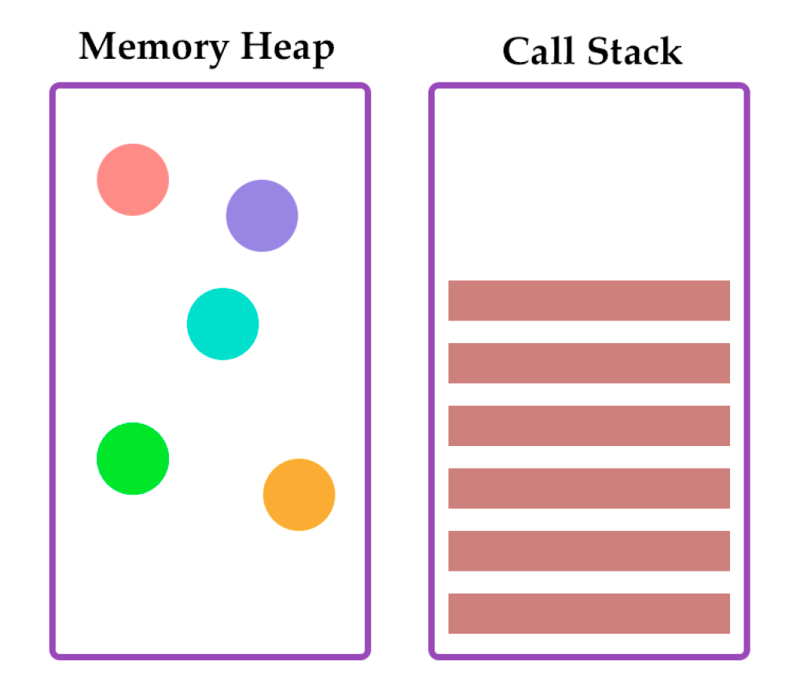
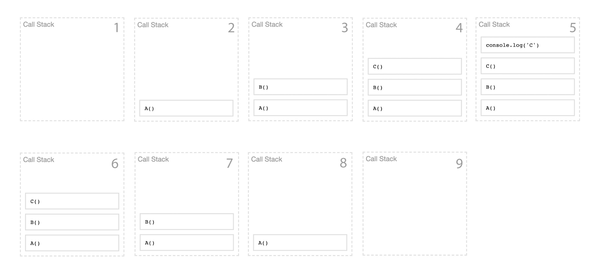

# Sincronía y Asincronía

1. Estos dos conceptos hacen referencia al tiempo en que se ejecutan múltiples procesos,tareas, eventos, métodos o funciones.
1. Por un lado tenemos el término `Síncrono`, y es cuando los procesos se ejecutan uno tras otro.
1. `Asíncrono`, y es cuando los procesos se ejecutan todos a la vez y no necesitan esperar a que finalicen los otros.

```
Ejemplo, Una lista de procesos se ejecuta de forma síncrona (o secuencial) cuando cada uno de los
eventos debe ejecutarse y finalizar para que pueda iniciar el siguiente. Por ejemplo, para
pagar el estacionamiento en un centro comercial cada persona debe ir a la máquina y
esperar a que la gente que está delante suyo pague el ticket. Cuando la persona que está
frente a la máquina retira el ticket, puede avanzar la siguiente.
```

```
Pero en el caso de una ejecución asíncrona, la respuesta sucede a futuro, es decir, una
operación asíncrona no esperará el resultado. Cada operación se ejecuta y devuelve
inmediatamente el control al hilo `Thread`, evitando el bloqueo. Finalmente, cuando cada
operación termine se enviará una notificación de que ha terminado, es entonces cuando la
respuesta se encola para ser procesada.
```

```
Siguiendo con el ejemplo anterior, en un centro comercial hay más de una máquina para
pagar el ticket, por lo tanto, puede haber varias personas pagando al mismo tiempo, en
donde cada persona recibirá la respuesta a su debido tiempo, sin interferir en el pago de las
otras personas. Por ende, dentro de la ejecución de procesos asíncronos se pueden
encontrar dos conceptos relacionados y muy importantes a la hora de manejar una solución,
éstos son la concurrencia y el paralelismo.
```

## Concurrencia y Paralelismo

1. `Concurrencia:` Esto se produce cuando dos o más tareas progresan simultáneamente. Como se muestra en la siguiente imagen.
1. `Paralelismo:` Ocurre cuando dos o más tareas se ejecutan, literalmente a la vez, en el mismo instante de tiempo. Como se muestra en la siguiente imagen.

## Event Loop o Bucle de Eventos

1. Para definir en pocas palabras el event loop, es el que se encarga de implementar las operaciones asíncronas.
1. El event loop se puede interpretar como un manejador del Call Stack en el motor JavaScript V8 que fue desarrollado por Google para usarse en el lado del cliente (Google Chrome) y en el lado del servidor (Node).



## Memory Heap
El Memory Heap concentra todas los objetos y datos dinámicos, como las variables y constantes que debe sostener en la memoria durante la ejecución de las aplicaciones.

## Call stack
Es una pila de procesos, parecida a una lista ordenada de tareas al que se van agregando sentencias para ser ejecutadas, donde cada proceso que agregamos va al final mientras espera a que se ejecute el resto de operaciones que le anteceden.

El event loop no solo implica poner procesos al Call Stack, sino que necesita de otros componentes en los que se determina cuál proceso se encola para llamarse, entre ellos `WEB API` y `Callback Queue` forman parte de éste.

## WEB API
1. funciones disponibilizadas por el navegador y que se pueden usar en JavaScript para comunicarnos e interactuar con el Frontend. Entre ellas están las de manipulación del DOM, geolocalización, notificaciones y muchas más.

## Callback Queue (Cola de devolución de llamada)
1. La cola de devolución de llamada (Callback Queue), es una lista de funciones que le envía la WEB API y que quedan en espera a ser insertadas al `Call Stack` para ejecutarse. Asimismo, está basada en una estructura de datos del tipo `FIFO`, es decir, el primer dato en entrar es el primero en salir.

### Ejercicio de Callback Queue
Ir a la url [http://latentflip.com/loupe/?code=!!!](http://latentflip.com/loupe/?code=!!!). Ingresa el siguiente código.

```JavaScript

    function C(){
        console.log('C')
    }
    function B(){
        C()
    }
    function A(){
        B()
    }
    A();

```


### Ejercicio propuesto (1)
Ejecuta el código mostrado a continuación en la página web [Loupe](http://latentflip.com/loupe/?code=!!!), y describe el comportamiento con tus propias palabras.

```JavaScript

    var A = [1, 2], B = [];

    for (var i = 0; i < A.length; i++) {
        B.push(sumarDos(A[i]));
    };

    function sumarDos(x) {
        return x + 2;
    };

    console.log(B)

```


